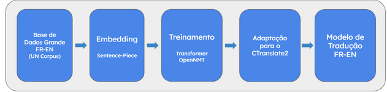
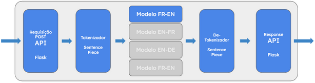

# Tradução FRV
## Visão Geral
O projeto Tradução FRV é um modelo de Rede Neural construído com a biblioteca [OpenNMT](https://opennmt.net/).
Foi construída uma API para a realização de requisições por meio da biblioteca Flask do Python.

### Problema
Com uma contínua expansão global, a Ambev, atualmente presente em 19 países, possui uma grande necessidade de orquestrar sua comunicação entre diversas línguas, mantendo a fala concisa e refletindo seu domínio de linguagem. Além disso, expandir a automatização de chatbots para muitas línguas pode ser custoso de manter, sendo importante uma forma que unifique os sistemas.

Uma das formas de centralizar o chatbot para todas as línguas, é possuir uma API de tradução que possa fazer a ponte entre o usuário e o chatbot original. Dessa maneira, a expansão para novas línguas requer apenas uma nova camada de tradução.

Além dessa aplicação, ter essa API de tradução pode ajudar a empresa em diversas outras tarefas de comunicação internas, facilitando a comunicação de seus funcionários que não possuem fluência no outro idioma.

### Solução
Foi construída uma API em Flask, que funciona como camada de tradução. Para que o texto seja traduzido basta realizar uma requisição POST utilizando JSON no HEADER ao link onde a API está rodando.
Abaixo, temos um exemplo de requisição
```
POST https://ufrjanalytica.loca.lt/fr_en
HEADERS content-type: 'application/json'

{
    "text": "J'aime Ambev"
}
```
## Informações Técnicas
## Gráfico Explicativo

 <figure>
  
  <figcaption>Fluxograma de como a tradução é gerada.</figcaption>
</figure> 

 <figure>
  
  <figcaption>Fluxograma de como a API retorna a tradução para o usuário.</figcaption>
</figure> 

## Processo de Instalação e Execução
Primeiramente devemos executar o notebook Notebook_Preparacao.ipynb, que irá baixar todos os modelos e dados importantes para a execução do projeto.
Com isso feito, podemos iniciar a execução da API de tradução, junto com os métodos de tradução, através do arquivo api.py.

## Pré requisitos
### Linguagens
* Python 
### Sistema Operacional
* Linux 
### Bibliotecas 
* ctranslate2, sentencepiece, flask, flask_restful, nltk, pandas, json

# Equipe

| [<br><sub>@FernandaSevero</sub>](https://github.com/FernandaSevero) | [<br><sub>@ronaldalbertjr</sub>](https://github.com/ronaldalbertjr) | [<br><sub>@viniciuslettieri</sub>](https://github.com/viniciuslettieri) |
| :---: | :---: | :---: |
